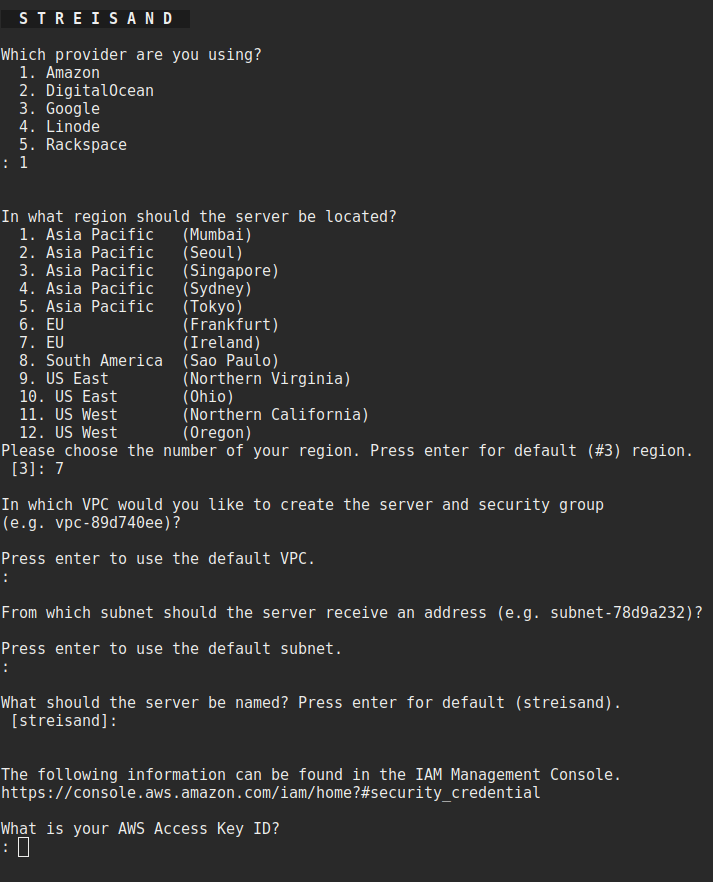

# Setup a Streisand VPN Server

### Authors: Joe Blankenship

#### University of Kentucky

#### 14 May 2018

## Introduction

This is a tutorial on how to setup a virtual private network (VPN) using an AWS free tier account and the Streisand project.

There are several reasons to setup a VPN, but perhaps one of the most is the protection of your communications with participants in your research.

## Setup an Amazon free tier account

Go [here](https://aws.amazon.com/free/) to setup an Amazon free account. You will be able to use this for one year for free so long as you stay within the data limits outlined in the free tier.

Once you have created an account and are logged in, go to **Services** and select **IAM**.

Then click on **Users** and select the **Add User** button.

Enter a **username** and check the **Programmatic Access** box. Then click the **Next: Permissions** button

Click the **Attach Existing Policies Directly button**. In the resulting window, type **Admin** in the search box, then selecting the **AdministratorAccess** option from the list. Once checked, click **Next**.

Click **Download .csv** and keep that file in someplace safe!

## Setup Streisand

> Note: You should be running this on an encrypted Linux-based operating system for maximum security.

You will need Python 2.7 for this (which comes pre-installed with most Linux systems). You will also need to have a SSH public key present in **~/.ssh/id_rsa.pub**. If you don't have this, type at the bash terminal and follow the instructions:

```
ssh-keygen
```

You will also need to install git and other dependencies:

```
sudo apt-get install git

sudo apt-get install python-paramiko python-pip python-pycurl python-dev build-essential
```

Then create a Python 2.7 virtual environment:

```
sudo pip install virtualenv
virtualenv --version=PYTHON2.7 vpn_install
```

Then enter the virtual environment, activate it, and install dependencies:

```
cd vpn_install
source bin/activate

pip install ansible markupsafe boto boto3
```

Clone the streisand software into your virtual environment:

```
git clone https://github.com/StreisandEffect/streisand.git && cd streisand
```

Once this is done, start the VPN server build process:

```
./streisand
```

Follow the prompts to choose the provider, the physical region for the server, and its name. When prompted for your **AWS Access Key ID** and **AWS Secret Access Key**, open the CSV file we created earlier. Copy and paste the appropriate information into the proper field.



The process can take about 10-15 minutes to complete after this.

## Using the Streisand VPN

In your home director, there should be a **streisand** directory generated by the install process. Open the **streisand.html** file inside of the directory.

Follow the directions for how to install SSL certificates to your browser and to connect to your server.

## References

Harvey, G. (2016). Streisand - setting up a secure, private and totally free VPN. Retreived from: http://devops.host/blog/streisand-vpn.html

Striesand Project on Github (2018). Retrieved from https://github.com/StreisandEffect/streisand#prerequisites

## License

This work is licensed under a [Creative Commons Attribution-NonCommercial-ShareAlike 4.0 International License](http://creativecommons.org/licenses/by-nc-sa/4.0/).
